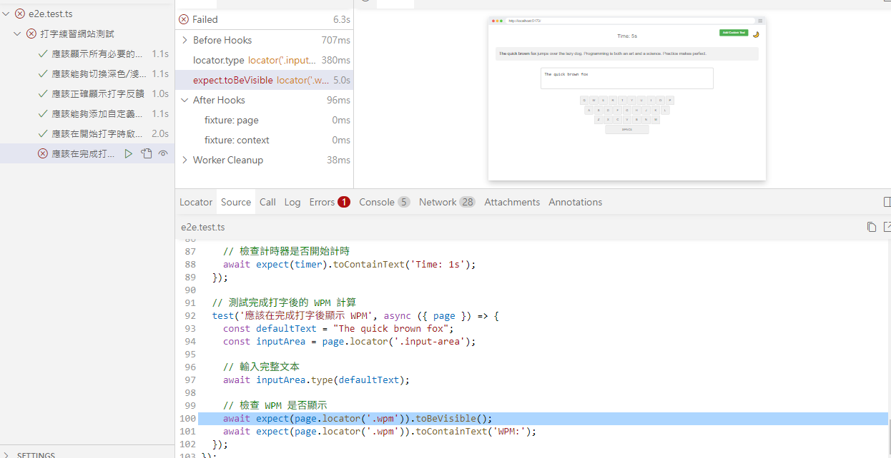

## prompt 1

你現在是一個專業的 QA 測試人員，需要幫我對以下的 vite-project2 程式碼進行 Playwright 的 E2E testing，語言為使用 Typescript，以下為目前的使用者需求

`user_prompts.md`

依照使用者需求生成出對應的 E2E testing script:
使用檔案上傳功能上傳全部程式碼

## result 1

測試WPM時，會有錯誤，因為沒有抓到 wpm 的元素，所以沒有辦法進行測試

## prompt 2

在"應該在完成打字後顯示 WPM"中
沒有輸入完整文本 導致測試錯誤

## result 2

通過所有測試
