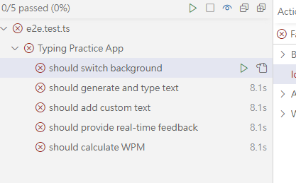
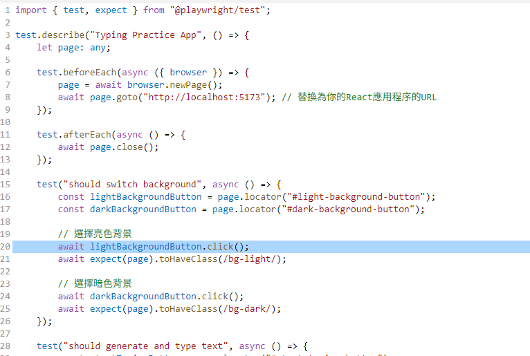
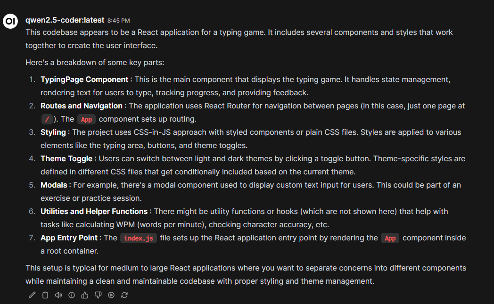
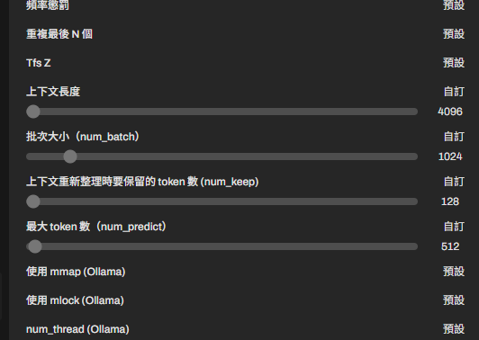
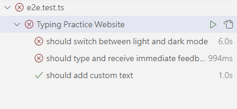

## prompt 1

你現在是一個專業的 QA 測試人員，需要幫我對以下的 React 程式碼進行 Playwright 的 E2E testing，語言為使用 Typescript，以下為目前的使用者需求

`user_prompts.md`

依照使用者需求生成出對應的 E2E testing script:
使用檔案上傳功能上船全部程式碼

## result 1

有順利生成出 typedscript 的 code，但是所抓的 locator 都是不存在的，猜測沒有讀到上船的 code



## prompt 2

和 prompt 1 一樣，但是改用複製貼上的方式上傳 code

## result 2

直接連 code 都生不出來


## 調整模型參數



最後可以生程式碼，但是還是有錯誤

```typescript
import { test, expect } from "@playwright/test";

test.describe("Typing Practice Website", () => {
    test.beforeEach(async ({ page }) => {
        await page.goto("/");
    });

    test("should switch between light and dark mode", async ({ page }) => {
        const themeToggle = page.locator(".theme-toggle");
        await themeToggle.click();
        await expect(page).toHaveClass(/dark/);

        await themeToggle.click();
        await expect(page).not.toHaveClass(/dark/);
    });

    test("should type and receive immediate feedback", async ({ page }) => {
        const inputArea = page.locator(".input-area");
        const keyboard = page.locator(".keyboard .key");
        const textDisplay = page.locator(".text-display");

        await inputArea.fill("");
        await keyboard.filter({ hasText: "T" }).click();
        await expect(textDisplay.locator("text=T")).toHaveCSS(
            "color",
            "rgb(0, 0, 0)"
        );
        await keyboard.filter({ hasText: "e" }).click();
        await expect(textDisplay.locator("text=Te")).toHaveCSS(
            "color",
            "rgb(0, 128, 0)"
        );
    });

    test("should add custom text", async ({ page }) => {
        const inputArea = page.locator(".input-area");
        const customTextButton = page.locator(".custom-text-btn");
        const modalTextarea = page.locator(".modal textarea");
        const modalSubmitButton = page.locator('.modal button[type="submit"]');

        await inputArea.fill("");
        await customTextButton.click();
        await modalTextarea.fill("This is a custom text for typing practice.");
        await modalSubmitButton.click();

        // Wait for the new text to be displayed
        await expect(page).toHaveTitle(/Custom Text/);
    });
});
```

## prompt 3

script 有語法錯誤:
Property 'toHaveClass' does not exist on type '{ not: MakeMatchers<void, Page, {}>; resolves: MakeMatchers<Promise<void>, Page, {}>; rejects: MakeMatchers<Promise<void>, any, {}>; } & PageAssertions & Matchers<...> & Pick<...> & ToUserMatcherObject<...>'.ts(2339)

修正此錯誤並給我完整的程式碼

### result 3

有另一個語法錯誤:
Expected 2-3 arguments, but got 1.ts(2554)
types.d.ts(2775, 34): An argument for 'name' was not provided.

## prompt 4

還是有語法錯誤:
Expected 2-3 arguments, but got 1.ts(2554)
types.d.ts(2775, 34): An argument for 'name' was not provided.

修正此錯誤並給我完整的程式碼

## result 4

生成出沒有語法錯的 code，但是明顯測試的過程有誤

