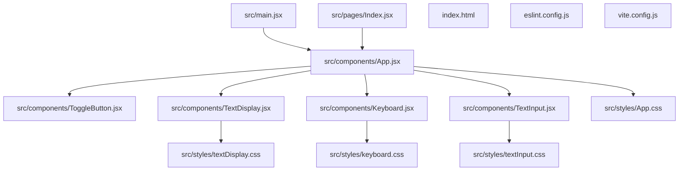
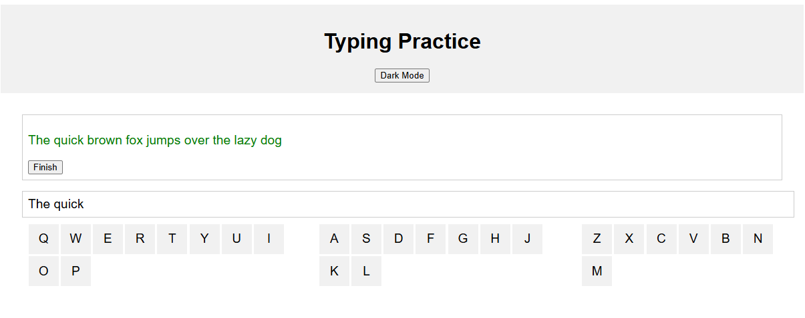

## prompts1

`project_config_template.md` + `user_prompts.md`

## result1

生成出的檔案結構如下:

```
vite-project/
├── src/
│   ├── components/
│   │   ├── App.jsx
│   │   ├── Keyboard.jsx
│   │   ├── TextDisplay.jsx
│   │   ├── TextInput.jsx
│   │   └── ToggleButton.jsx
│   ├── pages/
│   │   ├── Index.jsx
│   ├── styles/
│   │   ├── App.css
│   │   ├── common.css
│   │   ├── keyboard.css
│   │   ├── textDisplay.css
│   │   └── textInput.css
│   ├── App.jsx
│   ├── main.jsx
│   └── index.css
├── vite.config.js
└── package.json
```

但是生成出的檔案卻不符合結構的路徑，如每個元件的 css 路徑都是錯誤的
在`main.jsx`中的 StrictMode 用法錯誤

```jsx
import { createRoot } from "react-dom/client";
import Index from "./pages/Index";

createRoot(document.getElementById("root")).render(
    <React.StrictMode>
        <Index />
    </React.StrictMode>
);
```

## prompts2

以上生成的程式碼的所有 components 元件的 css 路徑都是錯誤的，css 是放在外層的 styles 裡面不是方在同一層，還有在`main.jsx`中的 StrictMode 用法錯誤，修正後給我所有的完整程式碼

## result2

還是一樣錯誤的。
自己修正路徑問題

修正後的結果如下


使用`claude3.5` 以及 `JavaParser` 所生成的關係依賴圖如下



## prompts3

在`TextDisplay.jsx`和`TextInput.jsx`中的結果有以下錯誤

-   開始輸入時顯示的文字會被清除，且會變成我打的文字，應該要是持續顯示原本的題目文字
-   題目的文字應該要在輸入文字後去變換顏色，如果輸入正確的話，文字會變成綠色，如果輸入錯誤的話，文字會變成紅色
-   題目的文本長度太低了，應該要有一個較長的文本
    以下是相關的程式碼，修正以上問題後給我完整的程式碼:

`TextDisplay.jsx`
`textDisplay.css`
`TextInput.jsx`
`textInput.css`

## result3

把 `TextDisplay.jsx` 改爛了，直接出現語法錯誤:

```jsx
import React from "react";
import "../styles/textDisplay.css";

const TextDisplay = ({ text, inputText, onCorrect, onIncorrect }) => {
    const isCorrect =
        inputText.toLowerCase() ===
        text.slice(0, inputText.length).toLowerCase();

    return (
        <div className="text-display">
            <p style={{ color: isCorrect ? "green" : "red" }}>{inputText}</p>
            {onStopTimer && <button onClick={onStopTimer}>Finish</button>}
        </div>
    );
};

export default TextDisplay;
```

## prompts4

在 TextDisplay.jsx 有以下錯誤:
TextDisplay.jsx:5 Uncaught TypeError: Cannot read properties of undefined (reading 'toLowerCase')
at TextDisplay (TextDisplay.jsx:5:33)

TextDisplay.jsx:16
Uncaught ReferenceError: onStopTimer is not defined
at TextDisplay (TextDisplay.jsx:16:14)
修正後給我完整的程式碼

## result4

還是有錯誤:
TextDisplay.jsx:5
Uncaught TypeError: Cannot read properties of undefined (reading 'toLowerCase')
at TextDisplay (TextDisplay.jsx:5:33)

```jsx
import React from "react";
import "../styles/textDisplay.css";

const TextDisplay = ({
    text,
    inputText,
    onCorrect,
    onIncorrect,
    onStopTimer,
}) => {
    const isCorrect =
        inputText.toLowerCase() ===
        text.slice(0, inputText.length).toLowerCase();

    return (
        <div className="text-display">
            <p style={{ color: isCorrect ? "green" : "red" }}>{inputText}</p>
            {onStopTimer && <button onClick={onStopTimer}>Finish</button>}
        </div>
    );
};

export default TextDisplay;
```

## prompts 5

在 TextDisplay.jsx 還是有錯誤:
TextDisplay.jsx:5
Uncaught TypeError: Cannot read properties of undefined (reading 'toLowerCase')
at TextDisplay (TextDisplay.jsx:5:33)

## result5

有解決語法問題，但是結果更糟了，連文本都不見了


## prompt 6

修正後出現以下錯誤:

-   題目文本不見了
    以下是目前的相關程式碼，修正錯誤後並給我五個完整的程式碼
    `TextDisplay.jsx`
    `textDisplay.css`
    `TextInput.jsx`
    `textInput.css`
    `App.jsx`
    `App.css`

## result6

只修正了 App.jsx

```jsx
import React, { useState } from "react";
import Keyboard from "./Keyboard";
import TextInput from "./TextInput";
import TextDisplay from "./TextDisplay";
import ToggleButton from "./ToggleButton";
import "../styles/App.css";

const App = () => {
    const [text, setText] = useState(
        "The quick brown fox jumps over the lazy dog"
    );
    const [isDarkMode, setIsDarkMode] = useState(false);
    const [startTime, setStartTime] = useState(null);
    const [endTime, setEndTime] = useState(null);

    const handleTextChange = (newText) => {
        setText(newText);
    };

    const startTimer = () => {
        setStartTime(Date.now());
    };

    const stopTimer = () => {
        setEndTime(Date.now());
        calculateWPM();
    };

    const calculateWPM = () => {
        if (startTime && endTime) {
            const elapsedTime = endTime - startTime;
            const wordsTyped = text.split(" ").length;
            const minutes = elapsedTime / 1000 / 60;
            const wpm = Math.round(wordsTyped / minutes);
            alert(
                `Completed in ${minutes.toFixed(2)} minutes with WPM: ${wpm}`
            );
        }
    };

    return (
        <div className={isDarkMode ? "dark-mode" : "light-mode"}>
            <header>
                <h1>Typing Practice</h1>
                <ToggleButton
                    isDarkMode={isDarkMode}
                    onToggle={() => setIsDarkMode(!isDarkMode)}
                />
            </header>
            <section>
                <TextDisplay
                    text={text}
                    inputText={text}
                    onStartTimer={startTimer}
                    onStopTimer={stopTimer}
                />
                <TextInput
                    onChangeText={handleTextChange}
                    onKeyPress={(key) => console.log(key)}
                />
                <Keyboard onKeyPress={(key) => console.log(key)} />
            </section>
        </div>
    );
};

export default App;
```

執行結果:


## prompts7

修正後還是雖然有出現題目文本，但還是有以下錯誤:

-   題目的文字應該要在輸入文字後去變換顏色，如果輸入和題目文本一樣的話，文字會變成綠色，如果輸入錯誤的話，文字會變成紅色，預設為黑色
-   題目的文本長度太低了，應該要有一個較長的文本
    以下是相關的程式碼，修正以上問題後給我完整的程式碼:
    `TextDisplay.jsx`
    `textDisplay.css`
    `TextInput.jsx`
    `textInput.css`
    `App.jsx`
    `App.css`

## result7

有語法錯誤:
App.jsx:43
Uncaught ReferenceError: inputText is not defined
at App (App.jsx:43:45)

## prompts8

App.jsx 有語法錯誤:
App.jsx:43
Uncaught ReferenceError: inputText is not defined
at App (App.jsx:43:45)

修正後給我完整的程式碼
